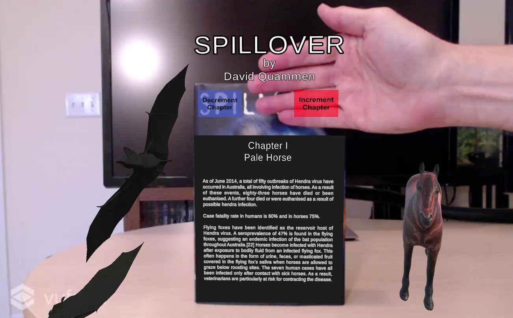
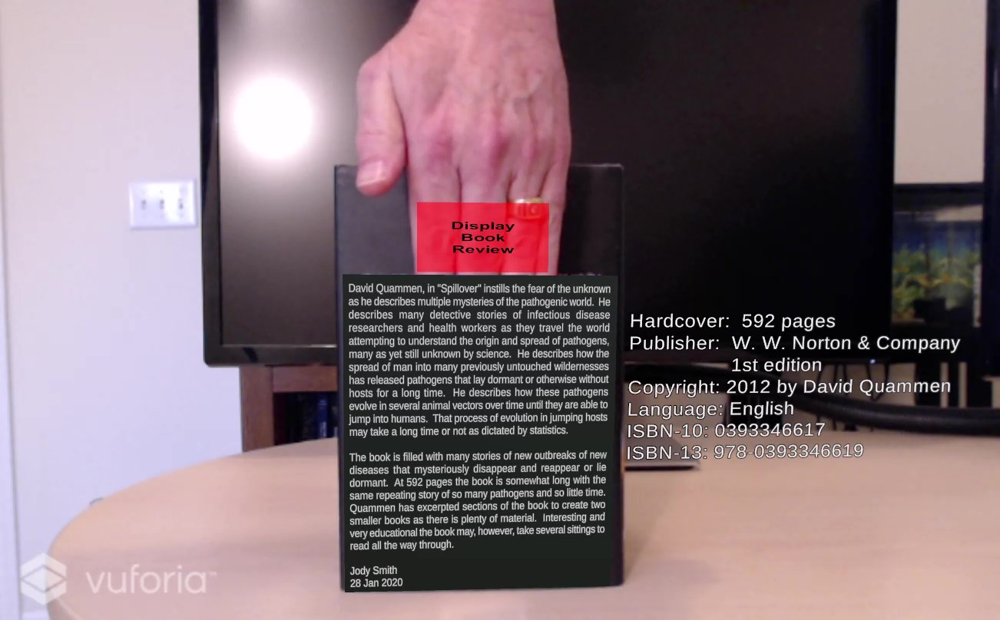

# Augmented Reality Book Cover
                                                     Project Two

                                                     Jody Smith
                                                Vanderbilt University
                                             CS8395 - Augmented Reality
                                                    Spring 2020

 This repository contains the Unity Project folders and C# Scripts for the realization of an augmented reality demonstration that uses a book as an object target to display and anchor 3D objects in the field of view.  3D text for the title, author and tag line display when the front of the book is in the field of view.  Additional multiple 3D geometry models display and are anchored to the book in real space as well.  The back book cover displays other book information such as the publisher, copyright, and page count.  An interactive virtual button is displayed on the back cover that when obscured from the camera a book review (by myself) appears on the back. When the area of the interactive button is no longer obscured the book review text will disappear.

 The project was created using Unity version 2019.2.19f1 (64-bit) and the add-in package of Vuforia version 8.6.7. After loading the project into Unity and selecting which camera to use on the local computer, click the play button at the top of the Unity interface.  By using a printed version of the book cover (provided with this repository) in the field of view of the camera the objects should appear on the printout in the 3D scene.

 This project is a complete rework of Assign-1-Book-Target as the original had some deficiencies and errors.  For this project audio was audio sounds were
 added when the book cover image targets are acquired and when the targets are lost to the camera.  Facts from each off the book chapters were added with 
 virtual decrement/increment buttons to sequence through the chapters.  Three dimensional animals are displayed that are representative of each chapter.
 
 
                                      
# Assign-2-Book-Target

                                                   AR View of Book 

Front cover of book image target

Back cover of book image target

